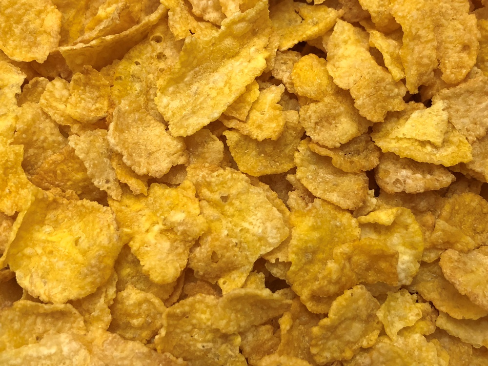

# How to Make Breakfast at My Apartment

## How to Make Corn Flakes (VEGAN)

(See Figure 4)

*(Figure 4)*

Sorry Armando, we don't have many vegan options in the apartment yet so
your choices will be quite lame for the time. I hope you know how to
pour things without spilling because that's pretty much the only thing
you need to know for this recipe (or at least how to clean up if you
don't pour neatly).

### Ingredients/Instruments

- Corn Flakes
  - Located in the pantry, upper door, top shelf
- Almond milk
  - Located in the fridge
- Raisins
  - Located in the pantry, upper door, bottom shelf
- Bowl
  - Located in the cabinet above the counter, to the left of the sink
- Spoon
  - Located in the second leftmost drawer when facing the family room
- 1c measuring cup
  - Second drawer from bottom, immediately left of the oven

### Instructions

1. Gather ingredients
2. Measure out 1c of Corn Flakes into the measuring cup
3. Pour the Corn Flakes into the bowl

    *Note: I would recommend you add a second cup of Corn Flakes, though it is not necessary*

4. Measure out 1c of Raisins into the measuring cup
5. Pour the Raisins into the measuring cup
6. Pour the almond milk into the bowl until only the top few layers of cereal are uncovered

    *Caution: I am allergic to almond milk, so please be careful with what it comes in direct contact with and please wash the bowl and spoon thoroughly when done*

7. Use the spoon to stir your mixture until the cereal becomes soggy

You have now made Corn Flakes! Please clean up when you are done and
please be careful regarding my allergies.


