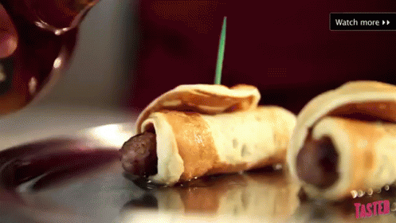
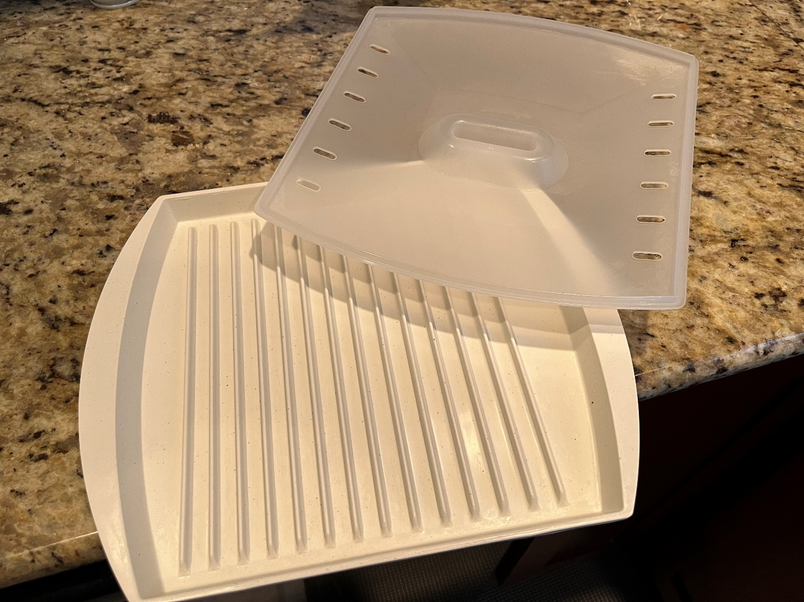

# How to Make Breakfast at My Apartment

## How to Make Pigs in a Blanket (NOT VEGAN)

(See Figure 1)

*(Figure 1)*

This recipe is fairly simple. It's just sausage wrapped in a pancake.
There are still detailed instructions on how to prepare everything
though. Prior to starting, you should know how to use a microwave, and
how to clean dishes. Please clean the dishes...

### Ingredients/Instruments

- Pork Sausage
  - Located in the freezer
  - I would recommend 2-4 links (1 per pig in a blanket)
- Buttermilk Pancakes
  - Located in the freezer
  - Same number of pancakes as you have sausages
- Plate
  - Located in the cabinet above the counter, to the left of the sink
  - Only one is needed
- Paper Towels
  - Located on the counter, left of the toaster oven
  - Only two (connected) sheets are needed
- Bacon/Sausage Griddle (See Figure 2)
  - Located in the cabinet above the microwave
- Maple syrup (optional)
  

*(Figure 2)*

### Instructions

1. Gather your ingredients
2. Take the lid off the griddle
3. Put the sausage into the griddle
4. Replace the griddle lid
5. Put griddle into microwave
6. Microwave the sausage
   - 30 seconds for 2 links
   - 45 seconds for 3 links
   - 60 seconds for 4 links
7. Remove griddle from microwave

    *Caution: The griddle may be hot*

8. Stack the pancakes on the plate
9. Wrap/Cover the pancakes with the paper towels
10. Put the plate into the microwave
11. Microwave the pancakes
    - 50 seconds for 2 pancakes
    - 1 minute 10 seconds for 3 pancakes
    - 1 minute 30 seconds for 4 pancakes
12. Remove plate from microwave

    *Caution: The plate may be hot*

13. Unwrap/Uncover the pancakes from the paper towel

    *Note: If you'd like, you may re-use the paper towel as a napkin while you eat. Otherwise, throw out the paper towel*

14. Unstack the pancakes
15. Lay the pancakes flat on the plate
16. Place the sausage in the middle of each pancake
17. Wrap the sausage in the pancake

    *Note: To keep from unwrapping, put the overlapping pancake on the bottom of the pig in a blanket and onto the plate*

**(Optional)**
18. If desired, pour maple syrup over the pigs in a blanket

You have now successfully made pigs in a blanket! Please remember to
clean up when you are finished.


